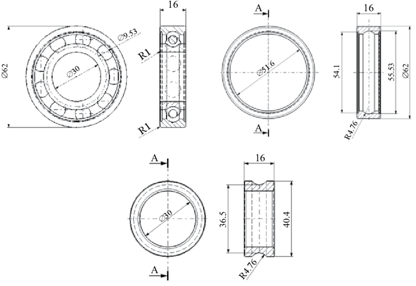

# Ball Bearing

Technical drawing from: https://www.researchgate.net/figure/Dimensions-of-ball-bearing-6206_fig2_317570537

References: 
- https://www.nationalprecision.com/products/category/ball-bearings/steel/6200-type/

