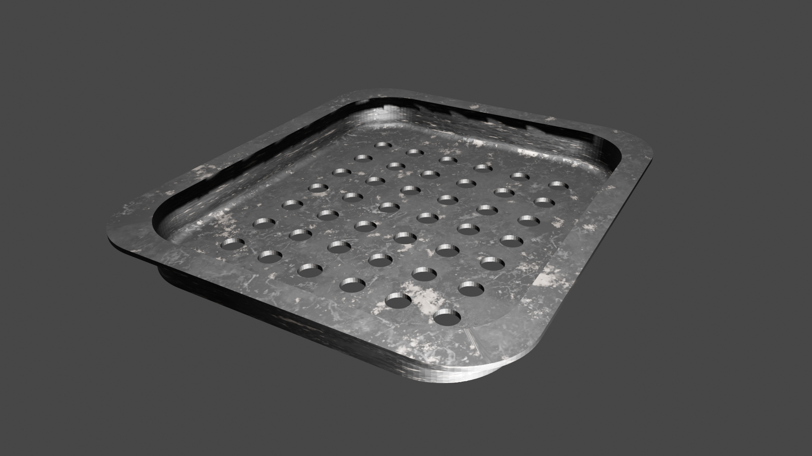

# CodeToCAD Examples

[CodeToCAD](https://github.com/CodeToCAD/CodeToCAD) is an opensource code-based modeling automation.

This repository contains examples of models created using CodeToCAD.

## Table of Contents

1. [Baking pan with holes](./1-baking-pan-with-holes/)
